# Introduction

In the introduction, teacher reinforced that React (and React Native) uses several components and when we program a mobile application we do not create a component by scratch. Instead of this we build an application using pre builded components.


# Repository related to the group of classes

[link](https://github.com/digitalinnovationone/trilha-react-native-components)


# Creating a new app

Teacher asked us to run the following command (seems equal to the previous command he passed):

```
npx create expo app components-overview -t
```

And in the question in the terminal about how template to use please select "Blank (TypeScript).

In the next steps in the introduction teacher only accessed the directory created by the previous command and run the following command:

```
npm run start
```

Teacher had to open an emulator in Android Studio. Then in the terminal of the previous command he clicked in the option "a" to run the app in the Android emulator.

Then the blank app was showed in the Android emulator.


# View

Teacher teached us that a View is equivalent to a "<div />" in HTML world.

In the next image teacher showed some examples of <View>s in a cellphone screen:


## Touching on a View

Teacher showed an example of handle touches in a View without a TouchableOpacity


Teacher also said that instead of an inline function you could use an external function as a handler.

A little comment: you could see in the image teacher dealing with a touch star and a touch end events.


## Documentation

Teacher showed that we can see more about views (selection in the left part of the image) and its events (selection in the right part of the image).


Teacher also teached that as you can see in the next image some events are specifically related to a platform (Android in the next image):


# Text

Teacher said that if you wanna to output a text in the app you must use the Text component:


And you could also use the Text component to other different thing, like simulating a button.


## Selectable text

Please use in the Text component the "selectable" (={true}) property:

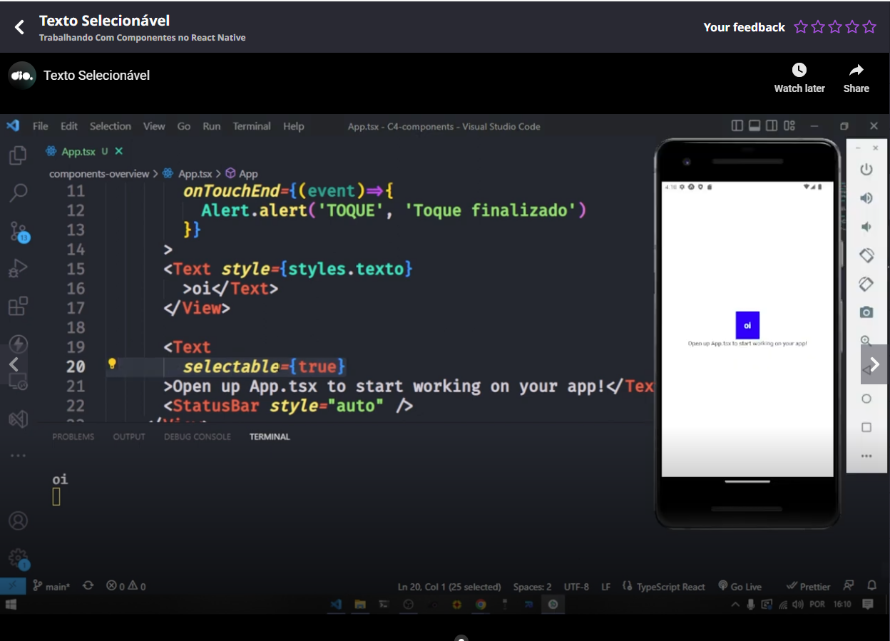


# Components and frameworks

Teacher said that besides React Native components, Expo provides some components also.


# Texts inside view and texts inside texts

Teacher shower that we can have as example two tags <Text> inside a <View> tag (a breack line will be inserted between the texts in this case) and you can have as example two texts inside another <Text> tag (a break line will not be inserted between the inner texts).

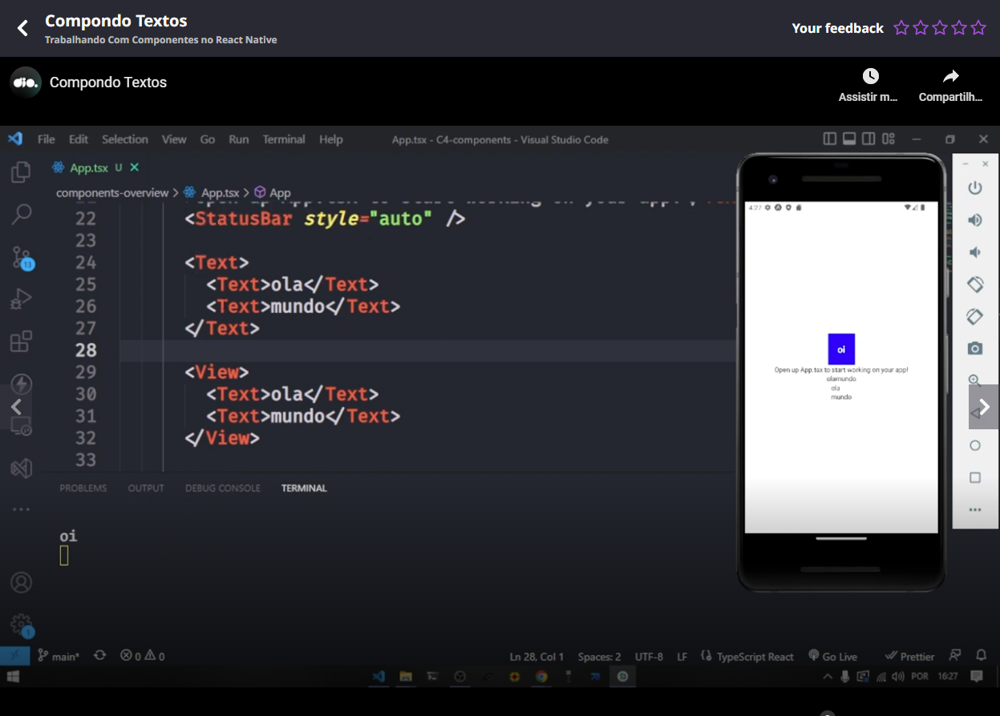


# Stylesheet

Teacher said that a Stylesheet mimics the behaviour of an HTML stylesheet.


## Creation

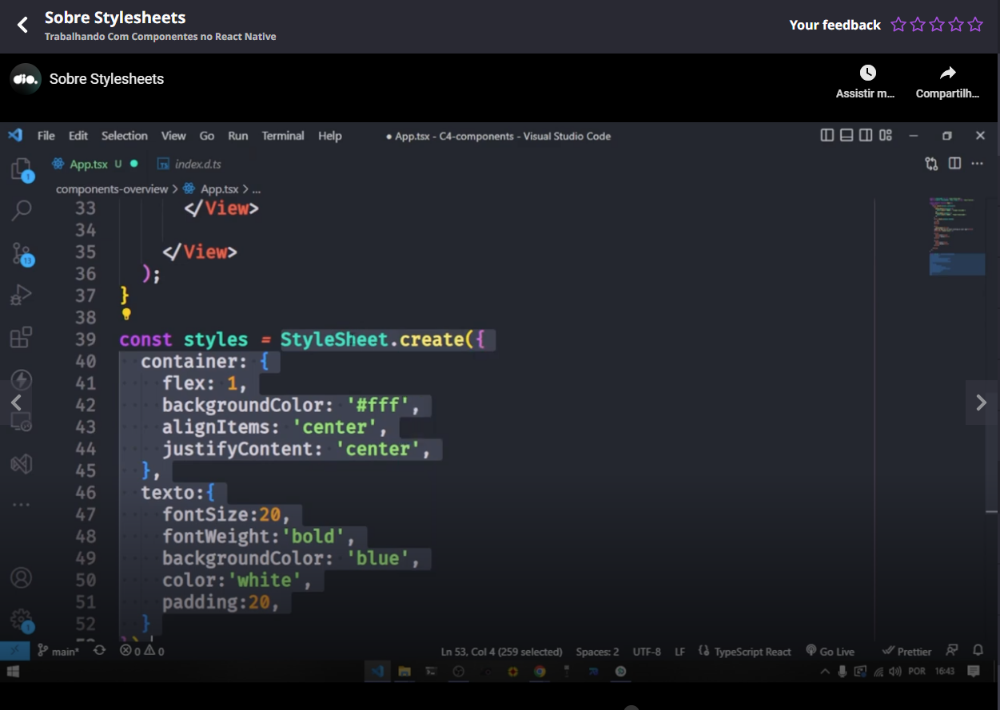


## Use

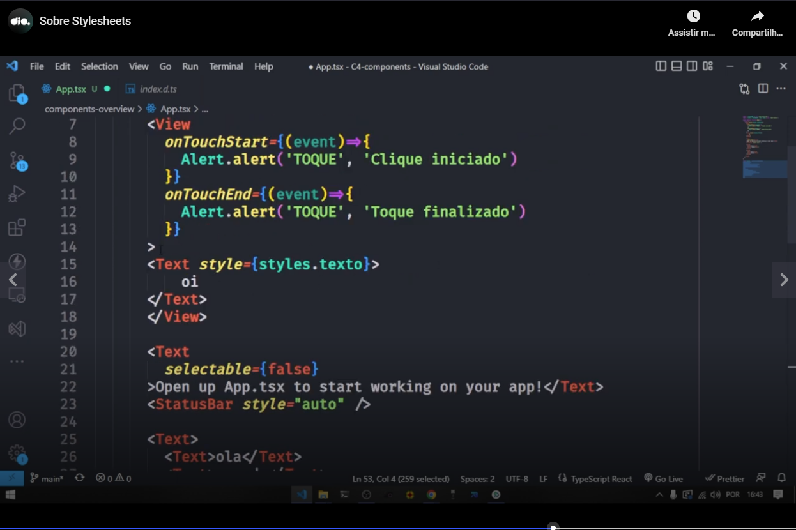


# Comments

Please pay attention that different from the HTML CSS where the words are separated by dashes, like "font-size", in React Native a camel case notation is used, like "fontSize".

Teacher also said that style components can be used to format the layout of a component, that teacher defined as formating the component inside of him itself.


## Array of styles in use

Teacher showed us that we can pass an array of styles to be used, includind an inline CSS, see:

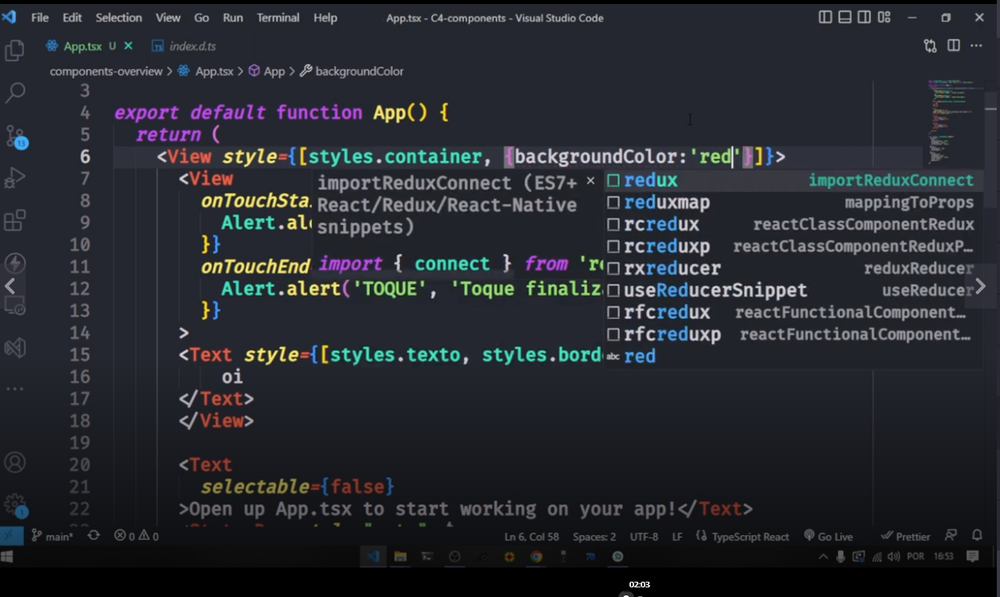

And in the case you have some repeteaded configuration, like "backgroundColor", the last will override the first.


# Pressing levels

Teacher showed that we can configure an action to different levels of pressure, like a long or a "normal" press:

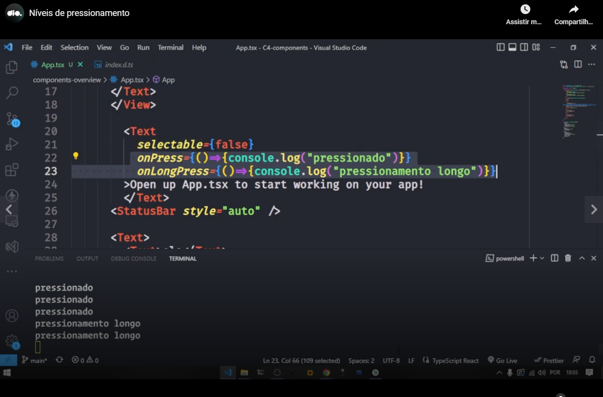


# Basic components

Teacher showed us these basic components:

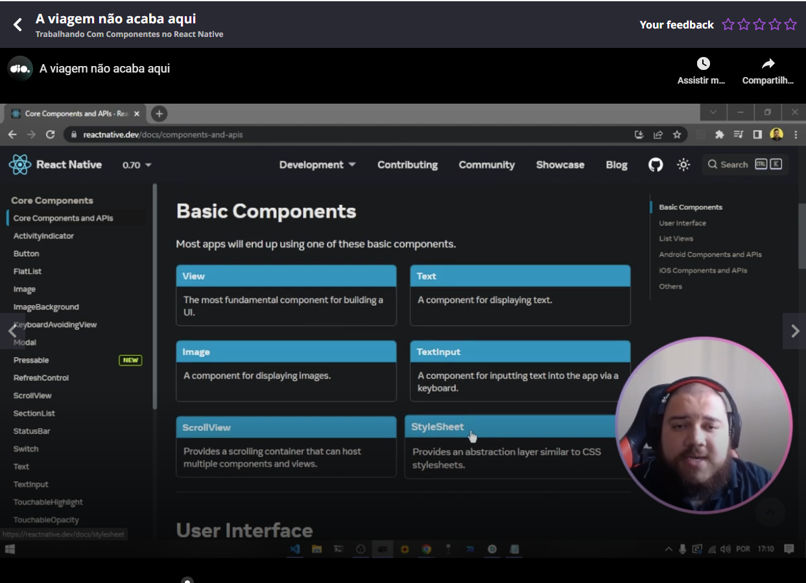


# A note about the scroll view

Teacher showed the documentation of ScrollView. ScrollView has events linked to scrolling (also).


Teacher showed an example of Views inside a ScrollView, this way you have automatically scroll in the app instead of a fixed view with its dimensions:

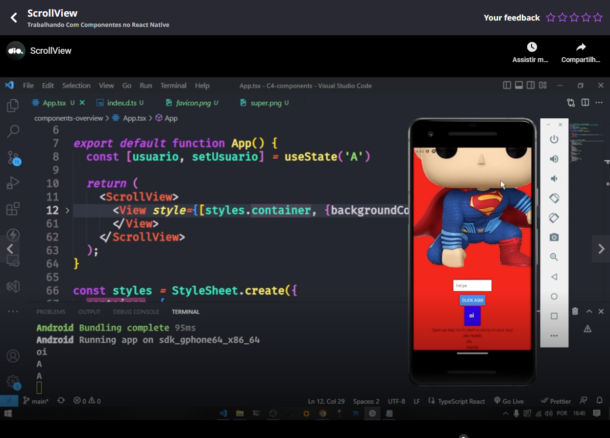


# images

One way you can specify the **source** (not "src") of the Image is this way:

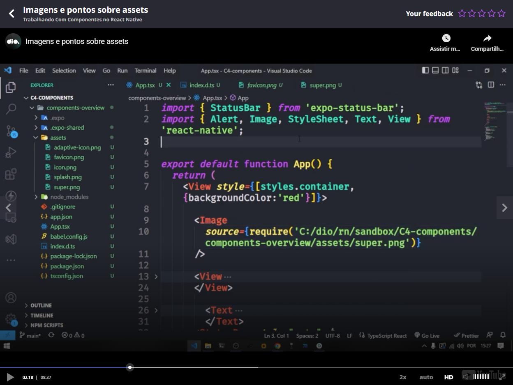

But you can import the image source:


In relation to the "style" property, teacher explained that we need to use two brackets on declaring an inline style an one bracket in the anohter case.

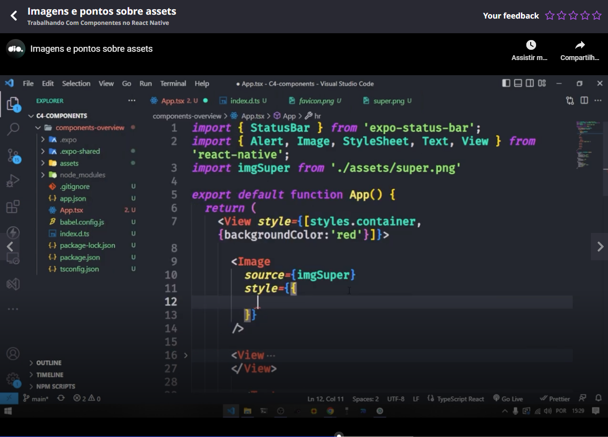

Example of inline style:

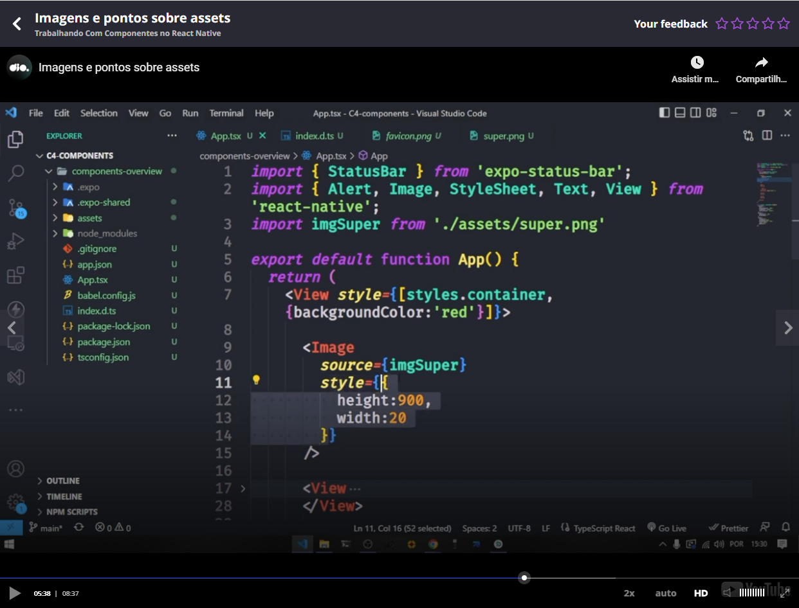


# External link

Teacher also passed [this link about components and APIs](https://reactnative.dev/docs/components-and-apis) in the complimentary materials area.